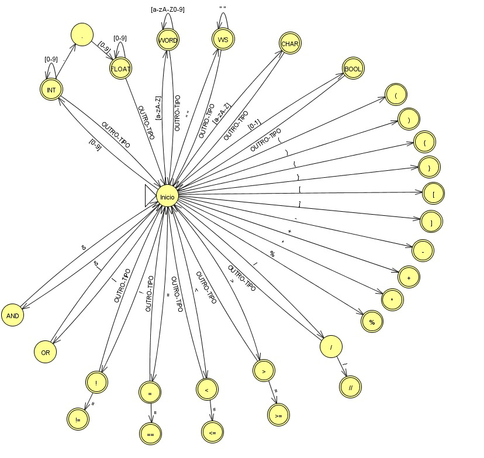

# Analisador Léxico em Python

Desenvolvendo um **Analisador Léxico** implementado em Python, baseado em um Autômato Finito Determinístico (AFD), projetado para processar código em linguagem similar a C.

### Visão Geral

O analisador léxico é a primeira fase do processo de compilação, responsável por converter uma sequência de caracteres (código fonte) em uma sequência de tokens (unidades léxicas significativas). Este projeto implementa um AFD que reconhece todos os elementos sintáticos da linguagem especificada, incluindo palavras reservadas, identificadores, números, operadores e delimitadores.

### Funcionalidades

O analisador é capaz de identificar e classificar:

- ⁠**Palavras Reservadas:⁠** ⁠ int ⁠, float⁠, char⁠, bool, if⁠, return ⁠
- ⁠**Identificadores:⁠** Nomes de variáveis (⁠ VAR ⁠)
- ⁠**Números:⁠**
    - Inteiros (⁠ NUM_INT ⁠): ex. ⁠ 123 ⁠, ⁠ 0 ⁠, ⁠ 999 ⁠
    - Ponto Flutuante (⁠ NUM_FLOAT ⁠): ex. .5⁠,⁠ 3.14 ⁠
- ⁠**Literais:** 
    - Caracteres (⁠ CHAR_TYPE ⁠): ex. ⁠ 'a', 'Z'⁠, '1' ⁠
  - Booleanos (⁠ BOOL_TYPE ⁠): com sensibilidade ao contexto para ⁠ 0 ⁠ e ⁠ 1
- **⁠Operadores Aritméticos:** ⁠
    - + ⁠ (SUM)
    - - ⁠ (SUB)
    - * ⁠ (MULT)
    - / (DIV)
    - % ⁠ (RESTO)
- ⁠**Operadores Relacionais:⁠**
    - \> ⁠ (GT)
    - < ⁠ (LT)
    - \>= ⁠ (GEQ)
    - <= ⁠ (LEQ)
    - == ⁠ (EQ)
    - != ⁠ (DIF)
- **Operadores Lógicos:⁠** ⁠
    - && ⁠ (AND)
    - || ⁠ (OR)
    - ! ⁠ (NEG)
- ⁠**Atribuição:⁠** ⁠ = ⁠ (Atribuicao)
- ⁠**Delimitadores:⁠**
    - ( ⁠ (LParenteses)
    - ) ⁠ (RParenteses)
    - { ⁠ (LChave)
    - } ⁠ (RChave)
    - [ ⁠ (Lcolchete)
    - ] ⁠ (RColchete)
    - , ⁠ (Virgula)
    - ; ⁠ (PVirgula)
- ⁠**Comentários:** Ignora comentários de linha iniciados por ⁠ // ⁠

### Autômato Finito Determinístico

O analisador implementa o seguinte AFD, desenvolvido através do programa JFLAP:



### Estrutura do Projeto
```
trabalho_analisador_lexico_python
├── index.py          # Código fonte do analisador léxico
├── README.md         # Documentação do projeto
├── output.lex        # Arquivo de saída gerado (exemplo)
└── test/
│   ├── input.c       # Arquivo de entrada para teste
└── img/
└── ├── afd-analisador-lexico.jpeg       # Imagem para o .md
```

### Como Executar

#### Pré-requisitos

Como pré-requisito é necessário ter o ```⁠Python 3.6``` ou superior

#### Instruções
1. ⁠Certifique-se de estar no diretório do projeto, para Linux e MAC faça:
```bash
cd ./pasta_raiz/trabalho_analisador_lexico_python
```
2. ⁠Execute o script passando o caminho do arquivo de entrada como argumento:
```bash
python index.py test/input.c
```

PS: O arquivo input.c é um arquivo de teste pré definido que pode ser modificado da forma que o usuário preferir.

#### Saída

Após a execução bem sucedida teremos um arquivo ```output.lex```  no diretório atual, contendo a sequência de tokens separados por espaço. Exibe no a saída da análise:

```curl
Analysis completed successfully!
Output: INTDEF VAR ASSIGNMENT NUM_INT PVirgula INTDEF VAR ASSIGNMENT NUM_INT PVirgula 
------------------------------ 
Generated file: output.lex
```

#### Exemplo

Com o arquivo de entrada ```test/input.c```⁠:
```c
int main()
{
    int a = 1;
    return 0;
}
```

A saída será:
```bash
INTDEF VAR LParenteses RParenteses LChave INTDEF VAR ASSIGNMENT NUM_INT PVirgula RETURN NUM_INT PVirgula RChave
```

### Detalhes da Implementação

#### Arquitetura
A classe ⁠ LexicalAnalyzer ⁠ implementa o AFD através de um loop principal que:
1. ⁠**Consome caracteres** do código fonte um a um
2. ⁠**Rastreia o estado atual** do autômato
3. ⁠**Acumula lexemas** (sequências de caracteres)
4. ⁠**Reconhece tokens** quando atinge estados finais
5. ⁠**Retorna a lista de tokens** após processar todo o arquivo

#### Estados Principais do Autômato

- **Estado 0 (Inicial):⁠** Ponto de entrada, identifica o tipo do lexema a ser processado
- ⁠⁠**Estado 1 (Inteiro):⁠** Lê números inteiros com uma ou mais dígitos
- ⁠**Estados 2-3 (Float):⁠** Processa números de ponto flutuante (ex: ⁠ .5 ⁠, ⁠ 3.14 ⁠)
- ⁠**Estado 4 (Identificador):⁠** Reconhece identificadores e palavras reservadas
- ⁠**Estados 17-24 (Operadores):⁠** Lidam com operadores simples e compostos com lookahead

#### Recursos Especiais
- **Contexto Semântico:** Diferencia entre ⁠ 0 ⁠/⁠ 1 ⁠ como ⁠ NUM_INT ⁠ ou ⁠ BOOL_TYPE ⁠ conforme a declaração de tipo anterior
- **Lookahead e Backtrack:** Implementa transições que requerem verificação do próximo caractere (necessário para operadores compostos como ⁠ == ⁠, ⁠ >= ⁠, ⁠ && ⁠)
- **Tratamento de Comentários:** Ignora automaticamente comentários de linha iniciados por ⁠ // ⁠
- **Recuperação de Erros:** Relata erros léxicos e continua a análise

#### Métodos Principais

- **analyze()⁠:** Loop principal que consome todo o arquivo e retorna a lista de tokens
- **get_next_token()⁠:** Implementa a lógica central do AFD, processando um token por chamada
- **peek_char()⁠:** Operação de lookahead sem consumir o caractere
- **consume_char()⁠:** Consome e retorna o próximo caractere
- **backtrack_cursor()⁠:** Recua o cursor quando necessário (para operadores simples vs. compostos)